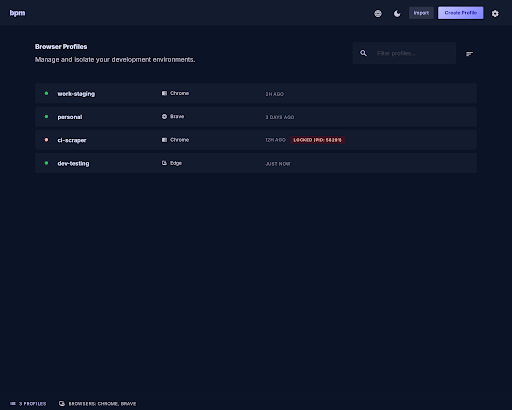
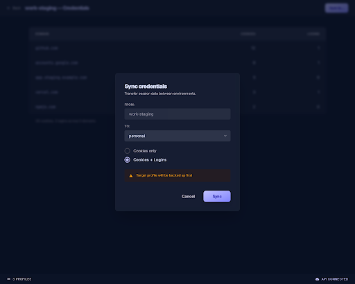
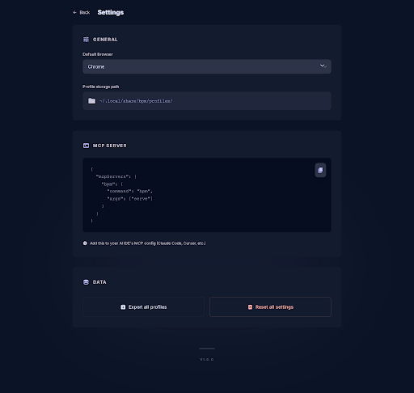

# bpm — Browser Profiles Manager

[]()
[]()
[]()
[]()

> Centralized browser profile management for AI IDEs

**bpm** is a CLI tool + MCP server that manages isolated Chromium browser profiles across AI-powered development environments like Claude Code, Cursor, and Antigravity.

---

## Why bpm?

AI IDEs spawn their own Chromium instances with ephemeral profiles:

| Pain Point | Impact |
|-----------|--------|
| 🔑 Login sessions lost between runs | Re-authenticate repeatedly (OAuth, 2FA) |
| 💥 Profile conflicts across parallel agents | Browser crashes, corrupt data |
| 🔄 No credential sync across tools | Each tool starts from scratch |
| 📁 Profiles scattered across filesystem | Hard to audit, clean up, back up |

**No existing tool solves this.** Browser MCP does automation, not profile management. AdsPower MCP is closed ecosystem. chrome-cli controls tabs, not profiles.

---

## Features

| Feature | Description |
|---------|-------------|
| **Profile CRUD** | Create, list, delete isolated browser profiles |
| **Browser Launch** | Launch Chromium with `--user-data-dir` + file lock |
| **Directory Mapping** | Map project dirs to profiles for auto-resolution |
| **Credential Sync** | Inspect & sync cookies/logins between profiles |
| **Import/Export** | Import existing Chrome profiles, export for backup |
| **MCP Server** | Expose all features to any AI IDE via MCP protocol |
| **Desktop App** | Simple GUI for visual management (Wails) |

---

## Quick Start

```bash
# Install
go install github.com/tquangkhai98/browser-profiles-manager@latest

# Create a profile
bpm create work-staging

# Launch browser with profile
bpm use work-staging

# Check what credentials exist
bpm creds work-staging

# Sync credentials to another profile
bpm sync work-staging personal

# Import existing Chrome profile
bpm import ~/Library/Application\ Support/Google/Chrome/Default my-chrome

# Map project directory to profile
bpm map ~/projects/my-app work-staging
```

---

## MCP Integration

Add to your AI IDE's MCP config (Claude Code, Cursor, Antigravity):

```json
{
  "mcpServers": {
    "bpm": {
      "command": "bpm",
      "args": ["serve"]
    }
  }
}
```

### MCP Tools

| Tool | Description |
|------|-------------|
| `profile_create` | Create a new isolated browser profile |
| `profile_list` | List all profiles with status |
| `profile_use` | Launch browser with profile |
| `profile_status` | Check lock status |
| `profile_delete` | Delete a profile |
| `mapping_set` | Map directory to profile |
| `mapping_get` | Resolve profile for a directory |
| `creds_inspect` | List credentials in a profile |
| `creds_sync` | Sync credentials between profiles |
| `browser_detect` | List installed browsers |

---

## AI Agent Integration

bpm profiles work with browser automation MCP servers, letting AI agents control browsers **with persistent login sessions**. Login once manually, then let your AI agent automate with full authentication — no re-login needed.

### Use Case: Multi-Role Testing

```bash
# Step 1: Create profiles for each role
bpm create lms-admin
bpm create lms-teacher
bpm create lms-student

# Step 2: Login once per profile (manual)
bpm use lms-admin      # → login as admin
bpm use lms-teacher    # → login as teacher
bpm use lms-student    # → login as student

# Step 3: AI agent uses profiles with persistent sessions ✅
```

### 🥇 Playwright MCP — Best Overall

Stable, official, uses accessibility tree for reliable element interaction.

```json
{
  "mcpServers": {
    "browser-admin": {
      "command": "npx",
      "args": [
        "@playwright/mcp@latest",
        "--user-data-dir", "~/.local/share/bpm/profiles/lms-admin"
      ]
    },
    "browser-teacher": {
      "command": "npx",
      "args": [
        "@playwright/mcp@latest",
        "--user-data-dir", "~/.local/share/bpm/profiles/lms-teacher"
      ]
    }
  }
}
```

### 🥈 Chrome DevTools MCP — Debug & Inspect

Connect to a running Chrome instance launched by bpm. Provides DOM inspection, Network monitoring, and Console access.

```bash
# Launch browser with remote debugging
bpm use lms-admin --debug-port=9222
```

```json
{
  "mcpServers": {
    "chrome-devtools": {
      "command": "npx",
      "args": ["chrome-devtools-mcp@latest", "--browserUrl=http://127.0.0.1:9222"]
    }
  }
}
```

### 🥉 Browser Use MCP — Natural Language

AI-native browser automation — describe actions in plain language instead of CSS selectors.

```json
{
  "mcpServers": {
    "browser-use": {
      "command": "npx",
      "args": [
        "browser-use-mcp@latest",
        "--user-data-dir", "~/.local/share/bpm/profiles/lms-admin"
      ]
    }
  }
}
```

### Comparison

| Tool | Session Persist | AI Control | Best For |
|------|:-:|:-:|----------|
| **Playwright MCP** | ✅ | ✅ | E2E testing, form automation |
| **Chrome DevTools MCP** | ✅ | ✅ | Debugging, network inspection |
| **Browser Use MCP** | ✅ | ✅ | Natural language automation |
| bpm CLI only | ✅ | ❌ | Manual testing |

> **⚠️ Important:** Never open the same profile in two browsers simultaneously — bpm uses file locks to prevent profile corruption.

---

## CLI Commands

```
bpm create <name>          Create isolated profile
bpm list [--json]          List profiles with status
bpm delete <name>          Delete profile + data
bpm status <name> [--json] Check lock/usage status
bpm use <name>             Launch browser with profile
bpm detect [--json]        List installed browsers
bpm map <dir> <profile>    Map project dir → profile
bpm map --auto [--json]    Auto-resolve profile for cwd
bpm map --list [--json]    Show all mappings
bpm creds <name> [--json]  Inspect credentials in profile
bpm sync <src> <dst>       Sync credentials between profiles
bpm import <path> <name>   Import existing Chrome profile
bpm export <name> <path>   Export profile for backup
bpm serve                  Start MCP server
```

### JSON Output

All read commands support `--json` for scripting and piping:

```bash
$ bpm list --json
[
  {
    "name": "work-staging",
    "browser": "chrome",
    "locked": false,
    "created_at": "2026-03-29T12:00:00Z"
  }
]

$ bpm detect --json
[
  {
    "name": "Google Chrome",
    "id": "chrome",
    "exe_path": "/Applications/Google Chrome.app/Contents/MacOS/Google Chrome"
  }
]

$ bpm creds work-staging --json
{
  "profile_name": "work-staging",
  "sites": [
    {"domain": "github.com", "cookie_count": 12, "login_count": 1}
  ],
  "total_cookies": 12,
  "total_logins": 1
}
```

---

## How Credential Sync Works

When you login to GitHub in one browser profile, that login is stored as cookies and saved passwords. **Credential sync** copies those databases to another profile:

1. Reads Chromium SQLite databases (`Cookies`, `Login Data`) from source
2. Backs up target profile's databases
3. Copies databases to target via atomic write (temp file → rename)
4. ⚠️ **bpm never decrypts passwords** — they work because Chromium uses OS-level keychain (macOS Keychain / Windows DPAPI)

---

## Screenshots

<p align="center">
  
  <br><em>Profile List — manage all browser profiles</em>
</p>

<p align="center">
  
  <br><em>Credential View — inspect & sync cookies/logins</em>
</p>

<p align="center">
  
  <br><em>Settings — configure defaults and MCP</em>
</p>

---

## Development

> 📖 New to Go? See [Go Quick Guide](docs/GO_GUIDE.md) — beginner-friendly development guide.

### Prerequisites

| Tool | Version | Install |
|------|---------|---------|
| Go | ≥ 1.25 | `brew install go` |
| Wails CLI | v2 | `go install github.com/wailsapp/wails/v2/cmd/wails@latest` |
| Node.js | ≥ 18 | `brew install node` (for desktop frontend) |

### Build & Test

```bash
make build          # Build CLI with version info
make test           # Run all tests
make cover          # Generate coverage report
make lint           # Run staticcheck
make install        # Install to $GOPATH/bin
make desktop        # Build desktop app
make dev            # Desktop dev mode with hot-reload
make clean          # Remove build artifacts
```

### Project Structure

```
browser-profiles-manager/
├── main.go                 # CLI entry point
├── cmd/                    # CLI commands (Cobra)
├── internal/               # Core business logic
│   ├── profile/            #   Profile CRUD + locking
│   ├── browser/            #   Browser detection & launch
│   ├── credential/         #   Credential read/sync (SQLite)
│   ├── mapping/            #   Directory ↔ profile mapping
│   ├── config/             #   Configuration management
│   └── mcp/                #   MCP server implementation
├── desktop/                # Wails desktop app
├── Makefile                # Build automation
└── docs/                   # Documentation
```

---

## Tech Stack

| Layer | Technology |
|-------|-----------:|
| Core + CLI | Go + Cobra |
| MCP Server | mcp-go (stdio) |
| Desktop App | Wails v2 |
| Storage | JSON config + filesystem |
| Credential read | modernc.org/sqlite (pure Go) |

## Platform Support

| Platform | Status |
|----------|--------|
| macOS | ✅ Supported |
| Windows | ✅ Supported |
| Linux | 🔜 Planned |

---

## Documentation

- [PLAN.md](PLAN.md) — Technical implementation plan
- [docs/PRD.md](docs/PRD.md) — Product requirements document
- [docs/STITCH.md](docs/STITCH.md) — Design wireframes (Stitch MCP)
- [docs/GO_GUIDE.md](docs/GO_GUIDE.md) — Go quick guide for beginners

## License

MIT
